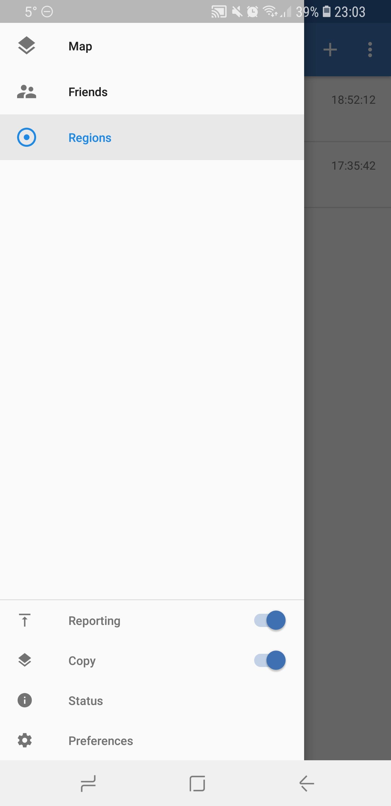
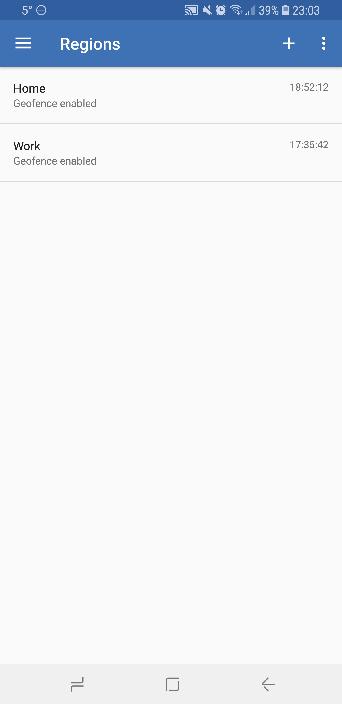
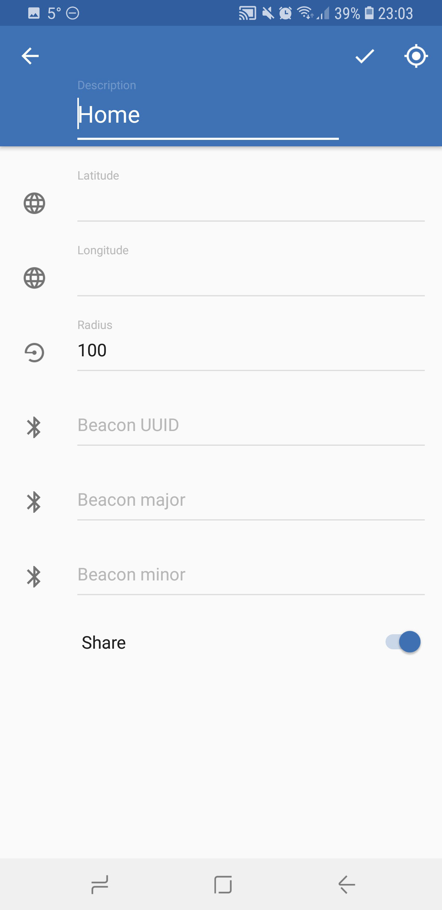
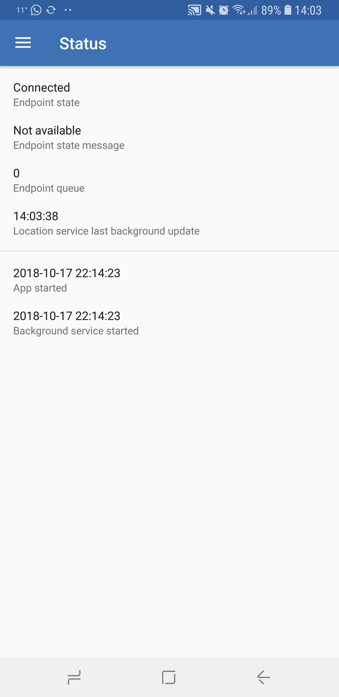

# ioBroker.owntracks
[OwnTracks](https://owntracks.org/) allows you to keep track of your own location. You can build your private location diary or share it with your family and friends. OwnTracks is open-source and uses open protocols for communication so you can be sure your data stays secure and private. You may find the respective smartphone apps in the [Apple App Store (iOS)](https://itunes.apple.com/us/app/mqttitude/id692424691?mt=8) or in the [Google Play Store (Android)](https://play.google.com/store/apps/details?id=org.owntracks.android).


[](https://www.npmjs.com/package/iobroker.owntracks)
[](https://travis-ci.org/iobroker-community-adapters/ioBroker.owntracks)
[](https://www.npmjs.com/package/iobroker.owntracks)

[](https://nodei.co/npm/iobroker.owntracks/)


**Table of contents**
1. [Setup instructions](#1-setup-instructions)
   1. [General configuration](#11-general-configuration-using-either-mqtt-server-or-client)
   2. [using MQTT server](#12-connection-configuration-using-mqtt-server)
   3. [using MQTT client](#13-connection-configuration-using-mqtt-client)
2. [Channels & States](#2-channels--states)
   1. [Locations](#21-locations)
   2. [Users](#22-users)
3. [Changelog](#changelog)
4. [Licence](#license)


## 1. Setup instructions
You have to setup ioBroker.owntracks in connection with the [MQTT adapter](https://github.com/ioBroker/ioBroker.mqtt), which will be installed as a dependency. The MQTT adapters may be setup as either a MQTT server or as a MQTT client.

The following tables shows a comparision:

| Method | Advantages / Disadvantages |
| ------ | ------------- |
| MQTT server |  fully encrypted payload possible<br> setup of an [dynamics DNS (DynDNS)](https://en.wikipedia.org/wiki/Dynamic_DNS) required<br> open Port in your router configuration necessary for communication ([read more here](https://owntracks.org/booklet/guide/broker/#firewall)) |
| MQTT client |  fully encrypted payload possible<br> usage of an Internet MQTT means all traffic is routed through an unknown provider ([read more here](https://owntracks.org/booklet/guide/scenarios/#mqtt-mode))<br> support for TLS only possible if available at the respective provider |

**IMPORTANT NOTE:** The states within ioBroker.owntracks will be generated when the specific payload is received! This means the locations in ioBroker will be generated **the first time the user leaves or enters the location**.
Below you will see the target structure ([see Channels & States for detailed list](#channels--states)):

[](https://raw.githubusercontent.com/Zefau/ioBroker.owntracks/master/img/structure.png)


### 1.1. General configuration (using either MQTT server or client)

#### Avatar configuration (within the ioBroker.owntracks adapter)
You can define for every user an icon. Just upload per drag&drop or with mouse click you image. It will be automatically scaled to 64x64.
__The name must be equal to DeviceID in OwnTracks app.__

#### Regions configuration
To setup locations within the owntracks adapter, you have to create regions in the owntracks Android / iOS app.
To do so, go to "Regions" in the drawer



Create a new region by clicking the plus (+) in the top right corner



Use the location button in the top right corner to retrieve current location or type them in Latitude and Longitude yourself. Furthermore, specify a radius for the location. If you share the location, your Friends (see in the drawer of the Android / iOS app) get a notification when you enter / leave a location. 




### 1.2. Connection configuration (using MQTT server)
You have to complete the following steps in order to setup ioBroker.owntracks via MQTT server:
1. Setup a DynDNS pointing to your IP address as well as open a port in your router
2. Configure MQTT adapter as server with the respective port
3. Configure all clients with the server settings

#### 1. Setup DynDNS and port
tbd

#### 2. Configure MQTT adapter
tbd

#### 3. Configure all clients

The following preferences have to be set in the Android / iOS app:

| Setting | Configuration |
| ------- | ------------- |
| Connection/Mode | MQTT private |
| Connection/Host/Host | IP address of your system or DynDNS domain |
| Connection/Host/Port | 1883 or your port on your router |
| Connection/Host/WebSockets | false |
| Connection/Identification/Username | iobroker |
| Connection/Identification/Password | from adapter settings |
| Connection/Identification/DeviceID | Name of device or person |
| Connection/Identification/TrackerID | Short name of user (up to 2 letters) to write it on map. |
| Connection/Security/TLS | off |
| Advanced/Encryption Key | optional, but recommended: Add passphrase for encryption |

Please verify owntracks is connected to iobroker instance via the "Status" entry in the drawer:




### 1.3. Connection configuration (using MQTT client)
You have to complete the following steps in order to setup ioBroker.owntracks via MQTT client:
1. Setup an external MQTT server hosted online, e.g. [CloudMQTT](https://www.cloudmqtt.com/)
2. Configure MQTT Cloud Broker and setup / authenticate clients
3. Configure MQTT adapter as client with the respective settings (URL, Port and Authentication of ioBroker)

#### 1. Setup external MQTT server
Go to [https://www.cloudmqtt.com/](https://www.cloudmqtt.com/) and sign up with a new account.
Create a new instance, select a plan (Free plan called _Cute Cat_ works fine) and name it _ioBroker_:


Go to the next step by clicking _Select Region_ and select the data center near you, e.g. _EU-West-1 (Ireland)_:


Verify your settings by clicking _Review_ and finally _Create Instance_.

#### 2. Configure MQTT Cloud Broker
After creating the instance, go to _SETTINGS_ and set `Use username as clientid` to `Yes`:


__Most importantly__, go to _USERS & ACL_ and add your desired users for the clients you are using (e.g. smartphones) and furthermore, add a specific user for your ioBroker:


Finally, add the necessary _ACL_ for the respective users further below on the same page. Do this by
1. select `topic`
2. select the user
3. type in the pattern `owntracks/#`
4. select both `read` and `write`

Your result should look like:


You have successfully setup CloudMQTT, you will receive messages which can be viewed via _WEBSOCKET UI_.

#### 3. Configure MQTT adapter
For this step, you will find the necessary information in the _DETAILS_ section of CloudMQTT:


After setting up your MQTT Cloud Broker, go to ioBroker and setup a MQTT instance.
The following tables shows the mapping from the CloudMQTT details page to your ioBroker.mqtt configuration:

| CloudMQTT setting | ioBroker.MQTT configuration | Example |
| ----------------- | --------------------------- | ------- |
| Server | URL | `m24.cloudmqtt.com` |
| SSL Port | Port | `24247` |
| - | Secure | `yes` |

For _Authentication settings_ you may use any user which has been authorized on CloudMQTT via _ACL_ (see above).
Change to _MQTT SETTINGS_ tab within ioBroker.mqtt and change the following settings:

| CloudMQTT setting | ioBroker.MQTT configuration | Note |
| ----------------- | --------------------------- | ---- |
| Subscribe patterns | `#` | |
| Prefix for all topics | - | |
| Mask to publish own states | mqtt.0.* | Replace 0 with your ioBroker.mqtt instance |
| Publish only on change | `yes` | |
| Publish own states on connect | `yes` | |
| Trace output for every message | `no` | |
| Send states (ack=true) too | `no` | |
| Use different topic names for set and get | `no` | |
| Client ID | `iobroker` | __This user has to be authorized via _ACL_ on CloudMQTT__ |
| Publish only on change | `yes` |

Finally, go to your ioBroker.owntracks instance and select the configured MQTT instance.

If everything has been setup successfully, ioBroker.owntracks will create the channels and states found below.


## 2. Channels & States
If you successfully setup ioBroker.owntracks, the following channels and states will be created **when the respective payload has been received**:

### 2.1. Locations
For each location within `locations.<locationId>`

| State | Description (possbile Values) |
|:----- |:----------------------------- |
| ```accuracy``` | Accuracy of the geographical coordinates of location |
| ```creation``` | Timestamp of creation time of location |
| ```creationDatetime``` | Date-Time of creation time of location |
| ```history``` | History of users entering / leaving location |
| ```locationId``` | Location ID of location |
| ```locationName``` | Location name of location |
| ```presence``` | Indicator whether any user is present in location [```true``` or ```false```] |
| ```refreshed``` | Timestamp of last change within the location |
| ```refreshedDatetime``` | Date-Time of last change within the location |
| ```users``` | Present users in location |

### 2.2. Users
For each user within `locations.<userId>`

| Channel | State | Description (possbile Values) |
|:------- |:----- |:----------------------------- |
| ```location``` | ```current``` | Current location of the user |
| ```location``` | ```entered``` | Timestamp the user has entered the current location |
| ```location``` | ```enteredDatetime``` | Date-Time the user has entered the current location |
| ```location``` | ```history``` | History of the user entering / leaving locations |
| ```location``` | ```last``` | Last location of the user |
| ```location``` | ```left``` | Timestamp the user has left the last location |
| ```location``` | ```leftDatetime``` | Date-Time the user has left the last location |
| - | ```accuracy``` | Accuracy of Latitude / Longitude |
| - | ```alt_accuracy``` | Accuracy of Altitude |
| - | ```altitude``` | Altitude |
| - | ```battery``` | Device battery level for the user |
| - | ```connection``` | Connection type of the user<br>- ```w```: phone is connected to a WiFi connection<br>- ```o```: phone is offline<br>- ```m```: mobile data |
| - | ```encryption``` | Encryption status for the user [```true``` or ```false```] |
| - | ```latitude``` | Latitude |
| - | ```longitude``` | Longitude |
| - | ```refreshed``` | Timestamp of last refresh |
| - | ```refreshedDatetime``` | Date-Time of last refresh |
| - | ```userConnected``` | Connection status of the user [```true``` or ```false```] |
| - | ```userId``` | User ID of the user |
| - | ```userName``` | User name of the user |
| - | ```userTid``` | Tracker ID of the user |
| - | ```velocity``` | Velocity for the user |


## Changelog

### 1.0.0-beta.1 (2019-05-01)
Refactored entire code and removed all MQTT package dependencies (to avoid / fix security issues and reduce complexity). Thus, added [MQTT adapter as dependency](https://github.com/ioBroker/ioBroker.mqtt) to manage all MQTT communication.
This major change comes with the following advantages:
- use both MQTT server as well as MQTT client (to use Internet MQTT server, such as [CloudMQTT](https://www.cloudmqtt.com/)) functionality (this adapter subscribes to foreign states of MQTT adapter)
- user avatars available in both server and client variant
- support TLS and websockets


## License
The MIT License (MIT)

Copyright (c) 2019 Zefau <zefau@mailbox.org>

Copyright (c) 2016-2019 bluefox <dogafox@gmail.com>

Permission is hereby granted, free of charge, to any person obtaining a copy
of this software and associated documentation files (the "Software"), to deal
in the Software without restriction, including without limitation the rights
to use, copy, modify, merge, publish, distribute, sublicense, and/or sell
copies of the Software, and to permit persons to whom the Software is
furnished to do so, subject to the following conditions:

The above copyright notice and this permission notice shall be included in
all copies or substantial portions of the Software.

THE SOFTWARE IS PROVIDED "AS IS", WITHOUT WARRANTY OF ANY KIND, EXPRESS OR
IMPLIED, INCLUDING BUT NOT LIMITED TO THE WARRANTIES OF MERCHANTABILITY,
FITNESS FOR A PARTICULAR PURPOSE AND NONINFRINGEMENT. IN NO EVENT SHALL THE
AUTHORS OR COPYRIGHT HOLDERS BE LIABLE FOR ANY CLAIM, DAMAGES OR OTHER
LIABILITY, WHETHER IN AN ACTION OF CONTRACT, TORT OR OTHERWISE, ARISING FROM,
OUT OF OR IN CONNECTION WITH THE SOFTWARE OR THE USE OR OTHER DEALINGS IN
THE SOFTWARE.
